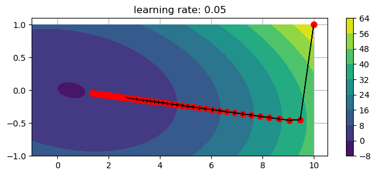
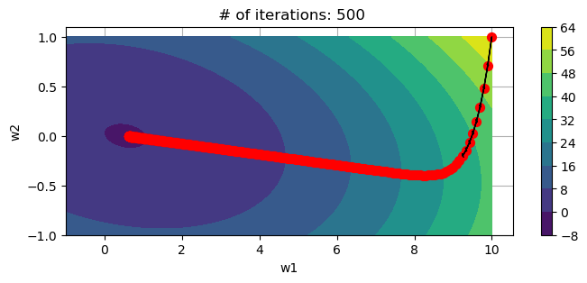
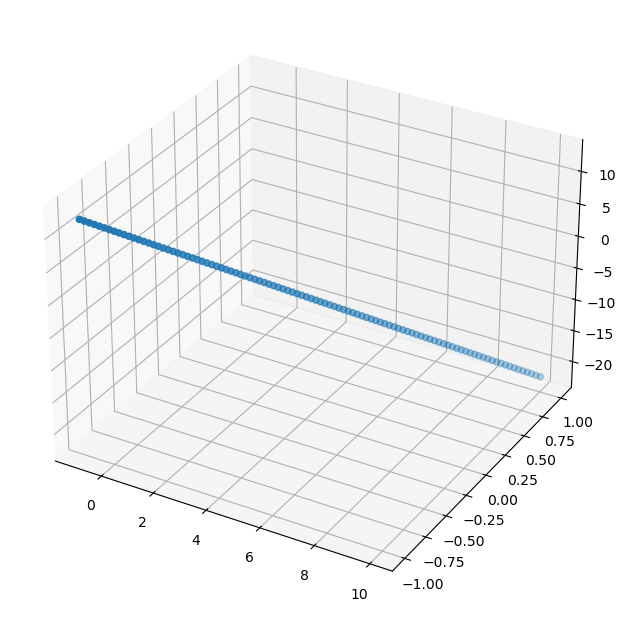

# Understanding behavior of various parameters of gradient descent algorithm
- I use AutoGrad Library [https://github.com/HIPS/autograd] to implement Gradient Descent
- The goal here is to study how:
    - Gradient Descent behaves when certain parameters are varied. Focus is on # of iterations and learning rate.
    - How to use Momentum to optimize or speed-up Gradient Descent.

#### Data
- x and y axis show the weights and contour surface shows the value of cost function.
- Convex function we are trying to minimize: g = lambda w: (a1 + np.dot(b1.T,w) + np.dot(np.dot(w.T,C1),w))[0]

#### Variation of learning rate

    Plot 1 for alpha = 0.01

    

    

    Plot 2 for alpha = 0.05

    

    

    Plot 3 for alpha = 0.1

    

    

    Plot 4 for alpha = 0.5

    

    

    Plot 5 for alpha = 1

    

    

## Observations:
1. Plot:1-If the learning rate is low the gradient descent takes a long time to reach the minimum  

2. Plot:3- As the learning rate is increasing we see zig-zag behavior of gradient descent 
    - zig-zag behavior slows learning down as it takes longer to reach the minimum. 
    - Plot-4: Learning rate of 1 is so high that GD completely diverges leading to very high cost function values as seen on y axis   

#### Variation of # of iterations

    Plot 6 for # of iterations = 50

    

    

    Plot 7 for # of iterations = 100

    

    

    Plot 8 for # of iterations = 500

    

    

    Plot 9 for # of iterations = 1000

    

    

## Observations
- For a given learning rate as the # of iteration increase the gradient descent converges to the minimum value of the function.
- For Plot 6 # of iterations are not enough to reach the minimum. As we increase # of iterations for the same function the plot converges. 

## Plotting cost function

    

    

## Plotting surface of cost function

    <matplotlib.colorbar.Colorbar at 0x15d635360>

    

    

#### References
- Machine Learning Refined, 2nd Edition, Jeremy Watt, Reza Borhani, Aggelos K. Katsaggelos.
