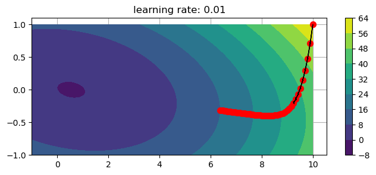

# Understanding behavior of various parameters of gradient descent algorithm
- I use AutoGrad Library [https://github.com/HIPS/autograd] to implement Gradient Descent
- The goal here is to study how:
    - Gradient Descent behaves when certain parameters are varied. Focus is on # of iterations and learning rate.
    - How to use Momentum to optimize or speed-up Gradient Descent.

#### Data
- x and y axis show the weights and contour surface shows the value of cost function.
- Convex function we are trying to minimize: g = lambda w: (a1 + np.dot(b1.T,w) + np.dot(np.dot(w.T,C1),w))[0]

#### Variation of learning rate

    Plot 1 for alpha = 0.01

    

    

    Plot 2 for alpha = 0.05

    

    

    Plot 3 for alpha = 0.1

    

    

    Plot 4 for alpha = 0.5

    

    

    Plot 5 for alpha = 1

    

    

## Observations:
1. Plot:1-If the learning rate is low the gradient descent takes a long time to reach the minimum  

2. Plot:3- As the learning rate is increasing we see zig-zag behavior of gradient descent 
    - zig-zag behavior slows learning down as it takes longer to reach the minimum. 
    - Plot-4: Learning rate of 1 is so high that GD completely diverges leading to very high cost function values as seen on y axis   

#### Variation of # of iterations

    Plot 6 for # of iterations = 50

    

    

    Plot 7 for # of iterations = 100

    

    

    Plot 8 for # of iterations = 500

    

    

    Plot 9 for # of iterations = 1000

    

    

## Observations
- For a given learning rate as the # of iteration increase the gradient descent converges to the minimum value of the function.
- For Plot 6 # of iterations are not enough to reach the minimum. As we increase # of iterations for the same function the plot converges. 

## Plotting cost function

    

    

## Plotting surface of cost function

    <matplotlib.colorbar.Colorbar at 0x15d635360>

    

    

#### References
- Machine Learning Refined, 2nd Edition, Jeremy Watt, Reza Borhani, Aggelos K. Katsaggelos.
## Applying momentum to gradient descent

- Gradient Descent ethod experiences zig-zag behavior or oscillations in certain situatuions. 
    1)  High learning rate
    2)  Mini-batches: Because mini-batch gradient descent makes a parameter update after seeing just a subset of examples, the direction of the update has some variance, and so the path taken by mini-batch gradient descent will "oscillate" toward convergence.   
 

- These oscillations can slow learning down and in some cases where learning rate is very high GD may diverge completely 

- We can solve this by using momentum that uses exponentially weighted averages as an underlying algorithm.
    1) Momentum takes into account the **past gradients** to smooth out the update. The 'direction' of the previous gradients is stored in the variable 𝑣.
    2)  $\beta$ is the weight of the previous data values and $1-\beta$ is the weight of the most recent values. 

#### Dataset
- Ford Dataset from - Machine Learning Refined, 2nd Edition, Jeremy Watt, Reza Borhani, Aggelos K. Katsaggelos.

<table border="1" class="dataframe">
  <thead>
    <tr style="text-align: right;">
      <th></th>
      <th>Date</th>
      <th>Open</th>
      <th>High</th>
      <th>Low</th>
      <th>Close</th>
      <th>Adj Close</th>
      <th>Volume</th>
    </tr>
  </thead>
  <tbody>
    <tr>
      <th>0</th>
      <td>1975-03-01</td>
      <td>1.070527</td>
      <td>1.248949</td>
      <td>1.062417</td>
      <td>1.204343</td>
      <td>0.002020</td>
      <td>48741400</td>
    </tr>
    <tr>
      <th>1</th>
      <td>1975-04-01</td>
      <td>1.204343</td>
      <td>1.244894</td>
      <td>1.119188</td>
      <td>1.167848</td>
      <td>0.001958</td>
      <td>29854600</td>
    </tr>
  </tbody>
</table>

### Example of Exponential Weighted Average
- Trying different values of $\beta$ to see exponentially weighted average.

    <matplotlib.legend.Legend at 0x16d645f60>

    

    

### Apply exponential weighted average to Gradient Descent 
- Convex function we are trying to minimize: g = lambda w: (a1 + np.dot(b1.T,w) + np.dot(np.dot(w.T,C1),w))[0]
- We see the how # of iterations to reach the minimum reduce after using gradient descent

    Plot-1: GD with # of iterations = 50

    

    

    Plot-2: GD with # of iterations = 25

    

    

    Plot-3: GD with # of iterations = 25

    

    

## Observations
- After using momentum GD reaches mininimum faster (with lower number of iterations) at the same learning rate. 
- Plot 1 we reach minimum when # of iterations are 50 and in Plot -3 when momentum is used we reach minimum with 25 iterations

## References
- Machine Learning Refined, 2nd Edition, Jeremy Watt, Reza Borhani, Aggelos K. Katsaggelos.

